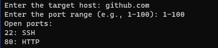

## Port Scanner

This is a simple port scanner written in Python. It is a command line tool that can be used to scan for open ports on a given IP address.

## Usage

To use the port scanner, simply run the following command:

```
python main.py
```

You can following this example to scan a specific IP address:

```bash
Enter the target host: github.com
Enter the port range (e.g., 1-100): 1-100
```

The result will be displayed in the terminal. See the picture:

